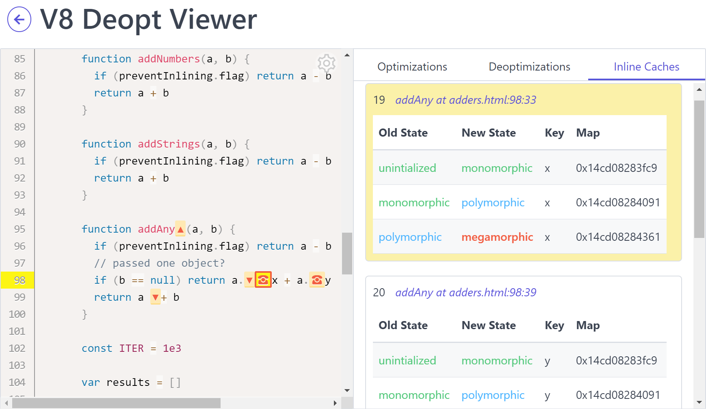

# v8-deopt-viewer

View deoptimizations of your JavaScript in V8



## You may not need this tool...

V8 only optimizes code that runs repeatedly. Often for websites this code is your framework's code and not your app code. If you are looking to improve your website's performance, first check out tools like [Lighthouse](https://developers.google.com/web/tools/lighthouse/) or [webhint](https://webhint.io/), and follow other general website performance guidance.

## Usage

Install [NodeJS](https://nodejs.org) 14.x or greater.

```bash
npx v8-deopt-viewer program.js --open
```

If you want run this against URLs, also install [`puppeteer`](https://github.com/GoogleChrome/puppeteer):

```bash
npm i -g puppeteer
```

The main usage of this repo is through the CLI. Download the `v8-deopt-viewer` package through [NPM](https://npmjs.com) or use [`npx`](https://medium.com/@maybekatz/introducing-npx-an-npm-package-runner-55f7d4bd282b) to run the CLI. Options for the CLI can be found using the `--help`.

```
$ npx v8-deopt-viewer --help

  Description
    Generate and view deoptimizations in JavaScript code running in V8

  Usage
    $ v8-deopt-viewer [file] [options]

  Options
    -i, --input         Path to an already generated v8.log file
    -o, --out           The directory to output files too  (default current working directory)
    -t, --timeout       How long in milliseconds to keep the browser open while the webpage runs  (default 5000)
    --keep-internals    Don't remove NodeJS internals from the log
    --open              Open the resulting webapp in a web browser
    -v, --version       Displays current version
    -h, --help          Displays this message

  Examples
    $ v8-deopt-viewer examples/simple/adder.js
    $ v8-deopt-viewer examples/html-inline/adders.html -o /tmp/directory
    $ v8-deopt-viewer https://google.com
    $ v8-deopt-viewer -i v8.log
    $ v8-deopt-viewer -i v8.log -o /tmp/directory
```

Running the CLI will run the script or webpage provided with V8 flags to output a log of optimizations and deoptimizations. That log is saved as `v8.log`. We'll then parse that log into a JSON object filtering out the useful log lines and extending the information with such as the severity of the deopts. This data is saved in a JavaScript file (`v8-data.js`). We copy over the files from the webapp for viewing the data (`index.html`, `v8-deopt-webapp.js`, `v8-deopt-webapp.css`). Finally, open the `index.html` file in a modern browser to view the results of the run.

## Prior work

- [thlorenz/deoptigate](https://github.com/thlorenz/deoptigate)

  This project started out as a fork of the awesome `deoptigate` but as the scope of what I wanted to accomplish grew, I figured it was time to start my own project that I could re-architect to meet my requirements
